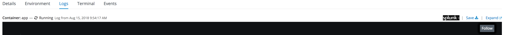

# Splunk Connect for OpenShift

  
This README explains how to integrate Splunk in OpenShift using the new [Splunk Connect for Kubernetes](https://github.com/splunk/splunk-connect-for-kubernetes).

  
## Requirements

Follow the [Splunk Connect Prerequistes](https://github.com/splunk/splunk-connect-for-kubernetes#prerequisites)

## Install HELM

```
cd /tmp
wget https://storage.googleapis.com/kubernetes-helm/helm-v2.9.1-linux-amd64.tar.gz
tar xvfz helm-v2.9.1-linux-amd64.tar.gz
cp linux-amd64/helm /usr/local/bin/
chmod +x /usr/local/bin/helm
```
  
## Configure Splunk Connect project

1. Create Project

    First of all, create the target project, with the correct permission

    ```
        oc adm new-project splunk-connect --node-selector=""
        oc project splunk-connect
    ```

    The node-selector is necessary to allow the daemonset to run in all the nodes.
    
    
2.  Create Service Account tiller and relative role
    
    ```
    oc create sa tiller
    oc adm policy add-role-to-user admin -z tiller
    ```

3. Deploy tiller

    ```
    helm init \
    --override 'spec.template.spec.containers[0].command'='{/tiller,--storage=secret,--listen=localhost:44134}' \
    --service-account=tiller \
    --tiller-namespace=splunk-connect    
    ```
>
> Information about securing HELM:
>    * [HELM Security](https://engineering.bitnami.com/articles/helm-security.html)
>    * [Securing HELM installation](https://docs.helm.sh/using_helm/#securing-your-helm-installation)
>    * [Tillerless HELM](https://rimusz.net/tillerless-helm/)
>

## Installation

1.  Download the HELM packages.  
    
    ```
    cd /tmp
    wget https://github.com/splunk/splunk-connect-for-kubernetes/releases/download/1.1.0/splunk-kubernetes-logging-1.1.0.tgz
    wget https://github.com/splunk/splunk-connect-for-kubernetes/releases/download/1.1.0/splunk-kubernetes-metrics-1.1.0.tgz
    wget https://github.com/splunk/splunk-connect-for-kubernetes/releases/download/1.1.0/splunk-kubernetes-objects-1.1.0.tgz
    ```
    
2.  Configure the variables for HELM.  

    >
    > Find here [samples](./samples) value for the splunk connect. 
    >    


### Splunk Kubernetes Logging

1. Create service account for logging.

    ```
    oc create sa splunk-kubernetes-logging
    ```

2. Assign privleged permission.

    ```
    oc adm policy add-scc-to-user privileged -z splunk-kubernetes-logging
    ```
    
    Logging pods need access to **/var/log/**

3. Install HELM package
    
    ```
    helm install --tiller-namespace=splunk-connect --name splunk-kubernetes-logging -f logging-value.yml splunk-kubernetes-logging-1.1.0.tgz
    ```

4. The following patch adds privileged securityContext and service account splunk-kubernetes-logging.

    ```
      oc patch ds splunk-kubernetes-logging -p '{
         "spec":{
            "template":{
               "spec":{
                  "serviceAccountName": "splunk-kubernetes-logging"
                  "containers":[
                     {
                        "name":"splunk-fluentd-k8s-logs",
                        "securityContext":{
                           "privileged":true
                        }
                     }
                  ]
               }
            }
         }
      }'
    ```

5. Delete the pods to apply the latest patch
    
    ```
    oc delete pods -lapp=splunk-kubernetes-logging
    ```

### Splunk Kubernetes Metrics

Splunk Connect for Kubernetes 1.1.0 replaces Heapster as the method for collecting metrics from Kubernetes.
Splunk built Fluentd plugins will now query, aggregate and send Kubernetes metrics to Splunk.


1. Assign cluster-reader and privleged permission.

    ```
    oc adm policy add-cluster-role-to-user cluster-reader -z splunk-kubernetes-metrics --rolebinding-name=splunk-kubernetes-metrics
    oc adm policy add-scc-to-user privileged -z splunk-kubernetes-metrics
    ```

    For fine-grained permission check metrics cluster role [manifests](https://github.com/splunk/splunk-connect-for-kubernetes/tree/master/manifests/splunk-kubernetes-metrics).


2. Install HELM package
    
    ```
    helm install --tiller-namespace=splunk-connect --name splunk-kubernetes-metrics -f metrics-value.yml splunk-kubernetes-metrics-1.1.0.tgz
    
    ```
    
3. The following patch adds privileged securityContext

    ```
    oc patch ds splunk-kubernetes-metrics -p '{
       "spec":{
          "template":{
             "spec":{
                "containers":[
                   {
                      "name":"splunk-fluentd-k8s-metrics",
                      "securityContext":{
                         "privileged":true
                      }    
                   }
                ]
             }
          }
       }
    }'
    
    oc patch deployment splunk-kubernetes-metrics-agg -p '{
       "spec":{
          "template":{
             "spec":{
                "containers":[
                   {
                      "name":"splunk-fluentd-k8s-metrics-agg",
                      "securityContext":{
                         "privileged":true
                      }    
                   }
                ]
             }
          }
       }
    }'
    ```
    
### Splunk Kubernetes Objects

1. Assign cluster-reader permission.

    ```
    oc adm policy add-cluster-role-to-user cluster-reader -z splunk-kubernetes-objects --rolebinding-name=splunk-kubernetes-objects
    ```

    For fine-grained permission check metrics cluster role [manifests](https://github.com/splunk/splunk-connect-for-kubernetes/tree/master/manifests/splunk-kubernetes-metrics).


2. Install HELM package

    ```
    helm install --tiller-namespace=splunk-connect --name splunk-kubernetes-objects -f objects-value.yml splunk-kubernetes-objects-1.1.0.tgz
    ```
    

# Splunk OpenShift Web Console Extension


- Source code and instruction: [OpenShift Web Console Extension](https://github.com/openlab-red/ext-openshift-web-console)

  * [Splunk Link](https://github.com/openlab-red/ext-openshift-web-console/blob/master/app/static/scripts/splunk-link.js)
  * [Splunk Style](https://github.com/openlab-red/ext-openshift-web-console/blob/master/app/static/styles/splunk-link.css)

- Update the webconfig-config.yaml configmap based on your settings

    ```yml
        extensions:
          properties:
            splunkURL: "https://splunk.openlab.red"
            splunkQueryPrefix: "/app/search/search?q=search%20"
            splunkApplicationIndex: 'ocp_logging'
            splunkSystemIndex: 'ocp_system'
            splunkSystemNamespacePattern: '^(openshift|kube|splunk|istio|default)\-?.*'
    ```

| Properties                   | Description                                          | Optional | Sample                                        |
|------------------------------|------------------------------------------------------|----------|-----------------------------------------------|
| splunkURL                    | Splunk Web Console Endpoint                          | N        |  https://splunk.openlab.red                   |
| splunkQueryPrefix            | Search Context Path                                  | N        | /app/search/search?q=search%20                |
| splunkApplicationIndex       | Index for application log                            | N        | ocp_logging                                   |
| splunkSystemIndex            | Index For infrastructure log                         | Y        | ocp_system                                    |
| splunkSystemNamespacePattern | Identify which namespace contains infrastructure log | Y        | '^(openshift\|kube\|splunk\|istio\|default)\-?.*' |
    
    
    


## Outcome



# Enjoy :)
